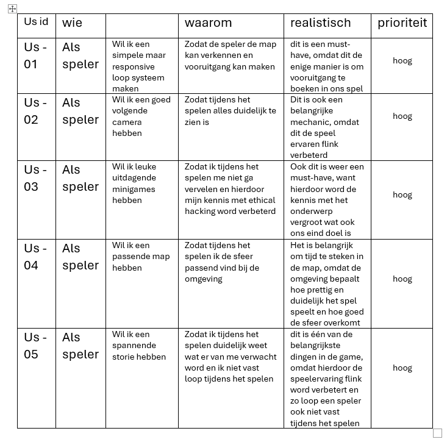

# Example user story

<!--  -->

Kleuren: <code style="color: red">hoog</code> <code style="color: darkorange">middel</code> <code style="color: gold">laag</code> 

| User ID | wie |  |  waarom | realistisch | priority | 
|:----------:|:------------:|:-----------:|:-----------:|:-----------:|:-----------:|
| 1 | Als speler | Wil ik een simple maar responsive loop systeem maken| Zodat de speler de map kan verkennen en vooruitgang kan maken | dit is een must-have, omdat dit de enige manier is om vooruitgang te boeken in ons spel | <code style="color: orangered">hoog</code>
| 2 | As speler | Content 2   | | |  <code style="color: orangered">hoog</code>
| 3 | As speler | Content 3   |